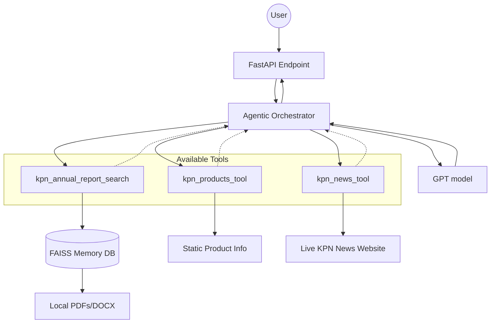

# KPN Agentic System Prototype

This project is a production-ready multi-agent AI system designed to answer questions about KPN using publicly available data, local documents, and live web scraping.

## 🏗️ System Architecture

The system follows a modular "Agentic RAG" pattern where an intelligent orchestrator chooses the best tool to answer a user's query.



## 🔄 Core Workflows

### 1. Document Ingestion (Startup)
1. **Scanning**: On startup, the `rag_service` scans `data/shared_docs/`.
2. **Chunking**: Text is split into 1000-character chunks with overlap.
3. **Embedding**: Chunks are converted to vectors via Azure OpenAI.
4. **Indexing**: Vectors are stored in a local **FAISS** index for millisecond search latency.

### 2. Query Orchestration (Runtime)
1. **Reasoning**: The Agent receives the user query and evaluates it against tool descriptions (docstrings).
2. **Action**:
    - **Local Knowledge**: If asking about finances or strategy, it triggers a semantic search on local documents.
    - **Product Knowledge**: For plans/services, it pulls from internal static data.
    - **Live Knowledge**: For recent news, it performs real-time web scraping.
3. **Synthesis**: retrieved data is combined with the original context to form a professional, cited response.

## 🚀 Features
- **Multi-Tool Intelligence**: Automatically switches between local RAG, static data, and live web scraping.
- **Local RAG Pipeline**: High-performance in-memory vector store using **FAISS**.
- **Dynamic Ingestion**: Hot-loads PDF, DOCX, and Text files.
- **Production Ready**: Built with FastAPI and designed for Azure scaling.

## 📂 Project Structure
- `app/`: Main FastAPI application.
    - `api/routers/agent.py`: API endpoints for interaction.
    - `services/agent_service.py`: Agent logic and tool orchestration.
    - `services/rag_service.py`: FAISS initialization and similarity search.
    - `services/kpn_tools.py`: Python-based tools (Scrapers, RAG searchers).
- `data/shared_docs/`: Drop folder for documents to be indexed.
- `utils/loaders.py`: Document loading and chunking utilities.
- `core/`: Application configuration (Pydantic).

## 🛠️ Setup and Installation

1.  **Clone the repository**.
2.  **Environment Variables**:
    Create a `.env.config` file with your Azure OpenAI details:
    ```env
    AZURE_OPENAI_ENDPOINT=...
    AZURE_OPENAI_KEY=...
    AZURE_OPENAI_API_VERSION=...
    AZURE_GPT_DEPLOYMENT=gpt-4.1
    AZURE_EMBEDDING_DEPLOYMENT=text-embedding-3-large
    ```
3.  **Install dependencies**:
    ```bash
    pip install -r requirements.txt
    ```

## 🏃 Running the Application
```bash
uvicorn app.main:app
```
The server will start, index local documents, and be available at `http://127.0.0.1:8000`.

## 📡 API Usage
**POST** `/agent/query`
```json
{
  "input": "What are the latest news headlines?",
  "chat_history": []
}
```
